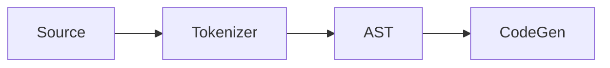
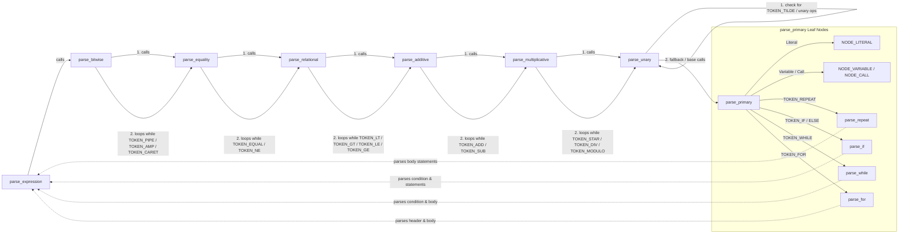

# Gravel's Internal Design

In this document I propose myself to write down Gravel's internals to make it easier to understand, hence making it easier for contributors to do so.

---

## Parts

Gravel uses this widely-used structure for programming languages:



We will now go through every stage before actually diving on how Gravel actually works.

### Source

Source is referred to the code that we want to compile. At this stage, the code is still the raw user input, usually saved on a file whose extension is from the language itself.

### Tokenizer

The tokenizer's job is to split the source into individual parts (called _tokens_) and revise that these are correct. Tokenizer is made by the lexer and the parser.

For example, if we have this line of our custom language:

```text
var age is 32
```

The tokenizer would generate something like:

```text
token_decl
token_name = "age"
token_is
token_number = 32
```

### AST

Then, the AST (_Abstract Syntax Tree_) generates a tree made out of custom nodes just as program or variable declaration.

So, following the last example, the AST would generate something like:

```text
NODE_PROGRAM {
  body=NODE_VARDECL {
    name="age"
    value=32
    type=int
  }
}
```

### CodeGen

The code generator (also _backend_ or _code generator_) goes through the AST and generates the final code.

For example, for the last example, if the backend language was C, it would generate something like:

```c
int main(void) {
    int age = 32;
    return 0;
}
```

## How Gravel Does These

After reviewing the basis of programming languages, I will explain how Gravel works in every of these stages, including real code and examples.

### Gravel's Tokenizer

First, we need to define some tokens:

`Gravel-Launcher/include/tokens.h`

```c
typedef enum {
    TOKEN_EOF,
    TOKEN_INT,
    TOKEN_CHAR,
    TOKEN_FLOAT,
    TOKEN_ADD,
    TOKEN_SUB,
    TOKEN_STAR, //Can be either pointer dereference or multiplication
    ... //more tokens here
} TokenType;
```

And after we have defined all the tokens, we need a way from going to source to a token array.

For these, we use a function to loop through the code to find symbols as `+` or `:=`.

`Gravel-Launcher/src/tokens.c`

```c
void tokenize(const char* file, ARGS_CONTEX* ctx) {
    const char* source = file;
    while (*source != '\0') {
        skipBlank(&source);

        if (*source == '\0') {
            break;
        }

        reserveTokenSpace();

        switch (*source) {
            case '+':
                tokens[token_count].type = TOKEN_ADD;
                break;
            case '-':
                if (*(source+1) == '>') {
                    tokens[token_count].type = TOKEN_ARROW;
                    source++;
                } else { 
                    tokens[token_count].type = TOKEN_SUB;
                }
                break;
            case '*':
                tokens[token_count].type = TOKEN_STAR;
                break;
```

 But for detecting bigger tokens, like words, we use a buffer at the same function:

 ```c
           default:
                if (isalpha(*source)) {
                    int len = 0;
                    char buffer[64];

                    while ((isalnum(*source) || *source == '.') && len < 63) {
                        if (*source=='\\' && *(++source) == 'n') {
                            buffer[len++] = '\n';
                        } else {
                            buffer[len++] = *source;
                            source++;
                        }
                    }
                    buffer[len] = '\0';

                    if (strcmp(buffer, "val") == 0) {
                        tokens[token_count].type = TOKEN_VAR_DEF;
                    } else if (strcmp(buffer, "scho") == 0) {
                        tokens[token_count].type = TOKEN_SCHO;
                    } else if (strcmp(buffer, "end") == 0) {
                        tokens[token_count].type = TOKEN_END;
                    } else if (strcmp(buffer, "namespace") == 0) {
                        tokens[token_count].type = TOKEN_NAMESPACE;
                    } else if (strcmp(buffer, "import") == 0) {
                        tokens[token_count].type = TOKEN_IMPORT;
                    }
                    ... //more tokens here
                    token_count++;
                    continue;                  
```

So after doing this, we successfully have an array of tokens with the correspondent value in case it isn't a keyword.

### Gravel's AST

To have an AST, first we need to have  some nodes defined, where we will say how every type of node is saved.

`Gravel-Launcher/include/ast.h`

```c
typedef enum {
    NODE_LITERAL,
    NODE_BINARY_OP,
    NODE_UNARY_OP,
    NODE_VARIABLE,
    NODE_DECLARATION,
    NODE_PROGRAM,
    NODE_SCHO,
    NODE_REPEAT,
    NODE_CONSTANT,
    NODE_FUN_DEF,
    NODE_CALL,
    NODE_IF,
    NODE_WHILE,
    NODE_FOR
} ASTNodeType;

typedef struct {
    char name[64];
    char type[64];
} fun_args;


typedef struct ASTNode {
    ASTNodeType type;

    union {
        struct {
            char value[64];
        } literal;

        struct {
            TokenType op;
            struct ASTNode* left;
            struct ASTNode* right;
        } binary_op;

        struct {
            char name[64];
            struct ASTNode* value;
        } var_decl;

        struct {
            struct ASTNode** statements;
            int count;
        } program;

        struct {
            int times;
            struct ASTNode** statements;
            int count;
            int repeat_count;
        } repeat_stmt;

        struct {
            struct ASTNode* value; 
        } scho_stmt;

        struct {
            struct ASTNode* condition;
            struct ASTNode** then_statements;
            int then_count;
            struct ASTNode* else_node; // can be NODE_PROGRAM or NODE_IF or NULL
        } if_stmt;

        struct {
            char name[64];
            struct ASTNode* value;
        } const_var;

        struct {
            char name[64];
            fun_args* arguments;
            char returnType[32]; // implement later
            struct ASTNode* body;
        } fun_def;

        struct {
            char name[64];
            char returnType[32];
        } fun_call;
    } data;
} ASTNode;
```

As we can see here, every type (function, program, definition...) has some values that the AST generator fills using a slightly more complex version of this:



This flow makes that operations are solved using the right precedence and that expressions and equality work as expected.

The actual code for this is too long to be put here, but you can find it at [`Gravel-Launcher/src/ast.c`](https://github.com/Pacsfury/Gravel-Launcher/blob/main/src/ast.c).

### CodeGen

After the AST is created, we need to generate the final code.

Gravel uses LLVM IR to do this, writing a plain `.ll` file.

What Gravel does is to crawl through the AST and execute some functions to generate the correct LLVM code.

`Gravel-Launcher/src/tollvm.c`

```c
static char* compile_node(FILE* outf, ASTNode* node, int* register_count) {
    if (!node) return NULL;

    switch (node->type) {
        case NODE_LITERAL: {
            const char* v = node->data.literal.value;

            if (strcmp(v, "\\n") == 0) {
                return safe_strdup("10");
            }

            if (strlen(v) == 1 && !isdigit((unsigned char)v[0])) {
                char buf[8];
                snprintf(buf, sizeof(buf), "%d", (int)(unsigned char)v[0]);
                return safe_strdup(buf);
            }
            return safe_strdup(v);
        }

        case NODE_VARIABLE: {
            int reg = (*register_count)++;
            fprintf(outf, "    %%%d = load i32, ptr @%s, align 4\n", reg, node->data.literal.value);
            
            char buf[32];
            snprintf(buf, sizeof(buf), "%%%d", reg);
            return safe_strdup(buf);
        }
```

Here we can see a chunk of the function to compile nodes. Other nodes call this to generate inner LLVM, like functions.

Gravel writes the file directly instead of saving the data in a buffer to then do a single `fprintf`, which can sometimes affect performance.

## How Does Gravel Handle...?

I will use this section to explain how Gravel handles more specific cases, like functions or declarations.

### Functions

For defining functions, Gravel uses a simple struct as seen here:

```c
typedef struct {
    char name[64];
    char type[64];
} fun_args;

...
        struct {
            char name[64];
            fun_args* arguments;
            char returnType[32]; // implement later
            struct ASTNode* body;
        } fun_def;
```

Later, the AST generator fills the gaps.

Right now, functions can't have args nor return types, so I have marked them as "implement later".

Every field of the struct has a specific job:

| **Name** | **Function** |
| ------------ | -------------- |
| name | Saves how the function will be called. |
| args | List of args, an array of a struct with type and name. |
| returnType | Will save what type does it return, just as int, char or a custom type. |
| body | Body is a pointer to a ASTNode, which is a NodeProgram saving the code that the function has. |

### If, elseif, else

For control flow we use this simple struct:
```c
        struct {
            struct ASTNode* condition;
            struct ASTNode** then_statements;
            int then_count;
            struct ASTNode* else_node; // can be NODE_PROGRAM or NODE_IF or NULL
        } if_stmt;
```

As before, I will now explain what every field does.

| **Name** | **Function** |
| ---------- | -------------- |
| condition | Points to a Node that saves the condition, so it can have function calls, operations and more inside. |
| then_statements | Double pointer to what need to be executed if the expression is true. It is a NodeProgram. |
| then_count | Stores how many AST nodes are stored inside `then_statements` so they know how many iterations to perform when evaluating or emitting code for that `if` branch. |
| else_node | This can store both null (no else), a program to execute if false or a NodeIf saving what to do if the condition is not true. |

#### Elseif

As we have seen, there is no "elseif" node, because we handle `elseif` on another way:

When doing so, a NodeIf is attached to the else_node, making a else if chain.

### While and For

Loops share a simple design. While is just a condition plus a body, while `for` adds an init and an increment around the same structure:

```c
        struct {
            struct ASTNode* condition;
            struct ASTNode** statements;
            int count;
        } while_stmt;

        struct {
            struct ASTNode* init;
            struct ASTNode* condition;
            struct ASTNode* increment;
            struct ASTNode** statements;
            int count;
        } for_stmt;
```

| **Name**    | **Function** |
|-------------|--------------|
| condition   | Expression evaluated before every iteration; the loop runs while it is truthy. |
| statements / count | The loop body, as an array of AST nodes. |
| init        | Only on `for`: executed once before the first check (e.g. `int i=0`). |
| increment   | Only on `for`: executed after each iteration (e.g. `i++`). |

The classic `for int i=0; i<10; i++` is stored as-is, while the modern
`for i in n` is desugared at parse time into an init (`i := 0`), a condition
(`i < n`) and an increment (`i++`), so both forms share the same codegen.

At LLVM emission, every loop gets three fresh basic blocks:
`loopcond<N>`, `loopbody<N>` and `loopend<N>`. The condition is compiled at
the start of `loopcond<N>` and a `br` decides whether to enter the body or
exit. The body ends with a `br` back to `loopcond<N>`, and (for `for`) the
increment is emitted just before that back-edge.

If the body ends in a `return`, the back-edge (and the `for` increment) is
skipped, since the `return` already exits the function.

Because every variable is stored as a global, loop variables are globals
too: declaring the same variable in nested loops (e.g. two `for i ...`
loops) reuses the same global and overwrites the outer counter.

### Namespaces

Namespaces are way simpler that they may seem: they don't even have  a struct!

Instead, the AST generator detects when a namespace starts and ends and prepending the name separating with a `.`.

So, this code:

```gravel
namespace numbers
    int one = 1
    int two = 2
end
```

will be saved internally at the AST something as:

```text
numbers.one = 1
numbers.two = 2
```

This decition (_namespace flattening_) is what natively allows _virtual namespaces_ to work exactly as normal ones.

## Optimizations

Right now, Gravel triggers two optimizations during the AST generation to make the final code faster and smaller.

* **Literal Folding**: while this is not still available for constant variables, arithmetical operations are resolved on compile time to reduce the quantity of "add" or "div" at the final LLVM code.

It works like this:

1. There is a binary_op.
2. We check that both sides are literals.
3. We do the operation and replace the old node for the new int_literal

* **Namespace Flattening**: As we saw before, instead of mapping memory or creating complex structures, Gravel converts namespaces into names separated by dots, creating a smaller memory usage and reducing the execution type calculations.
